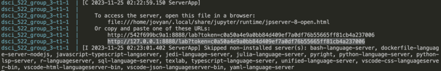

# Predicting Direction of Stock Price from Interest Rate and Inflation Rate

-   Authors: Allen Lee, Andy Zhang, Chengyu Tao, Yi Yan

A demo of a data analysis project for DSCI 522 (Data Science workflows); a course in the Master of Data Science program at the University of British Columbia.


## About

During the COVID-19 pandemic, central banks around the world lowered interest rates to ease economical challenges posed by the pandemic. As the pandemic ease, the lowered interest rate leads to excess consumer spending which increased the inflation rate to unacceptable levels. In order to control the inflation and have it return to pre-pandemic levels, the central bank raised the interest rate sharply to the highest level in 15 years. Nowadays, inflation and interest rate often takes the headline of financial news and with more than 50% of American households owning stocks (Caporal, 2023), our team is curious to find out how inflation and interest rate affect stock returns. We ask the question: given inflation rate and interest rate data, can we predict whether we will profit if we invest in a stock market index and hold for 1 year.

## Report

The final report can be found [here](https://ubc-mds.github.io/stock_price_direction_prediction_from_interest_and_inflation_rate/predicting_direction_of_stock_price_from_inflation_rate_and_interest_rate.html).

## Dependencies

Docker is a container solution used to manage the software dependencies for this project. The Docker image used for this project is based on the `quay.io/jupyter/minimal-notebook:2023-11-19` image.

More detailed dependencies are specified in this [Dockerfile](https://github.com/UBC-MDS/stock_price_direction_prediction_from_interest_and_inflation_rate/blob/main/Dockerfile).

## Usage

### Setup

1.  Install and launch Docker on your computer from the website: <https://www.docker.com/get-started/>

2.  Clone the GitHub repository to your own laptop.

### Running the analysis

1.  Open the Docker app.

2.  Enter the following command in the project root folder terminal, where you git cloned the project.

```         
docker compose up
```

3.  In the terminal, look for a URL that starts with <http://127.0.0.1:8888/lab?token=>, as highlighted in the graph. Copy and paste that URL into your browser.



4.  To run the analysis, enter the following commands in the jupyter lab terminal in the project folder

    ```         
    # download and extract data
    python src/data_read.py \
    --price_name='^gspc' \
    --cpi_link='https://fred.stlouisfed.org/graph/fredgraph.csv?bgcolor=%23e1e9f0&chart_type=line&drp=0&fo=open%20sans&graph_bgcolor=%23ffffff&height=450&mode=fred&recession_bars=on&txtcolor=%23444444&ts=12&tts=12&width=1318&nt=0&thu=0&trc=0&show_legend=yes&show_axis_titles=yes&show_tooltip=yes&id=CPIAUCNS&scale=left&cosd=1913-01-01&coed=2023-09-01&line_color=%234572a7&link_values=false&line_style=solid&mark_type=none&mw=3&lw=2&ost=-99999&oet=99999&mma=0&fml=a&fq=Monthly&fam=avg&fgst=lin&fgsnd=2020-02-01&line_index=1&transformation=lin&vintage_date=2023-11-11&revision_date=2023-11-11&nd=1913-01-01' \
    --interest_link='https://fred.stlouisfed.org/graph/fredgraph.csv?bgcolor=%23e1e9f0&chart_type=line&drp=0&fo=open%20sans&graph_bgcolor=%23ffffff&height=450&mode=fred&recession_bars=on&txtcolor=%23444444&ts=12&tts=12&width=1318&nt=0&thu=0&trc=0&show_legend=yes&show_axis_titles=yes&show_tooltip=yes&id=DFF&scale=left&cosd=1954-07-01&coed=2023-11-08&line_color=%234572a7&link_values=false&line_style=solid&mark_type=none&mw=3&lw=2&ost=-99999&oet=99999&mma=0&fml=a&fq=Daily%2C%207-Day&fam=avg&fgst=lin&fgsnd=2020-02-01&line_index=1&transformation=lin&vintage_date=2023-11-11&revision_date=2023-11-11&nd=1954-07-01' \
    --gspc_out_path='data/raw/gspc_raw.csv' \
    --cpi_out_path='data/raw/cpi_raw.csv' \
    --interest_out_path='data/raw/interest_raw.csv'

    # clean dataset
    python src/data_clean.py \
    --gspc_raw_path='data/raw/gspc_raw.csv' \
    --cpi_raw_path='data/raw/cpi_raw.csv' \
    --interest_raw_path='data/raw/interest_raw.csv' \
    --out_path='data/processed/cleaned_data.csv'

    #extract features from the dataset
    python src/feature_extract.py \
    --data_path='data/processed/cleaned_data.csv' \
    --out_path='data/processed/processed_data.csv'

    # split data into train and test sets, and pre-processed data for EDA
    python src/train_test_split_class.py \
      --processed_data_path='data/processed/processed_data.csv' \
      --random_state='123' \
      --test_data_ratio='0.2'\
      --x_train_path='data/processed/x_train.csv' \
      --y_train_path='data/processed/y_train.csv' \
      --x_test_path='data/processed/x_test.csv' \
      --y_test_path='data/processed/y_test.csv'

    # perform eda
    python src/eda.py \
      --processed_data_path='data/processed/processed_data.csv'\
      --x_train_path='data/processed/x_train.csv'\
      --y_train_path='data/processed/y_train.csv'\
      --time_path='results/figures/time.png'\
      --hist_path='results/figures/hist.png'\
      --scat_path='results/figures/scat.png'

    # create model
    python src/classification.py \
      --x_train_path='data/processed/x_train.csv' \
      --y_train_path='data/processed/y_train.csv' \
      --x_test_path='data/processed/x_test.csv' \
      --y_test_path='data/processed/y_test.csv' \
      --out_path='results/tables/mdl_result.csv'

    #run the below code, if you encounter error when exporting jupyter-book
    python -m ipykernel install --user --name conda-env-522Group3-py

    # renter HTML report and save to docs folder
    jupyter-book build report
    cp -r report/_build/html/* docs
    ```

### Clean up

1.  To shut down the container and clean up the resources, type `Cntrl` + `C` in the terminal where you launched the container or close the jupyter lab browser.
2.  Then type
```
docker compose rm
```

## Developer notes

### Adding a new dependency (cite from Tiffany's [repo](https://github.com/ttimbers/breast_cancer_predictor_py/tree/v1.0.0) )

1.  Add the dependency to the `Dockerfile` file on a new branch.

2.  Re-build the Docker image locally to ensure it builds and runs properly.

3.  Push the changes to GitHub. A new Docker image will be built and pushed to Docker Hub automatically.

4.  Update the `docker-compose.yml` file on your branch to use the new container image.

5.  Send a pull request to merge the changes into the `main` branch.

### Running the tests

Tests are run using the `pytest` command in the root of the project. More details about the test suite can be found in the `tests` directory.

```         
pytest tests/*
```

## License

Copyright (c) 2023 Master of Data Science at the University of British Columbia. CC BY 4.0 DEED Attribution 4.0 International. Creative Common License. For detailed information please refer to LICENSE.md.

## References

Caporal, J. (2023). How many Americans own stock? more than you think. The Motley Fool. <https://www.fool.com/research/how-many-americans-own-stock/>

Harris, C.R. et al., (2020). Array programming with NumPy. Nature, 585, pp.357--362.

McKinney, W. (2010). "Data Structures for Statistical Computing in Python." In Proceedings of the 9th Python in Science Conference, edited by Stéfan van der Walt and Jarrod Millman, 51--56.

Pedregosa, F. et al., (2011). Scikit-learn: Machine learning in Python. Journal of machine learning research, 12(Oct), pp.2825--2830.

VanderPlas, J. et al., (2018). Altair: Interactive statistical visualizations for python. Journal of open source software, 3(32), p.1057.

Van Rossum, G.,& Fred L. D. (2009). Python 3 Reference Manual. Scotts Valley, CA: CreateSpace.

Yahoo!. S&P 500 (\^GSPC) charts, Data & News. (n.d.). Yahoo! Finance.<https://ca.finance.yahoo.com/quote/%5EGSPC?p=%5EGSPC&.tsrc=fin-srch>.
